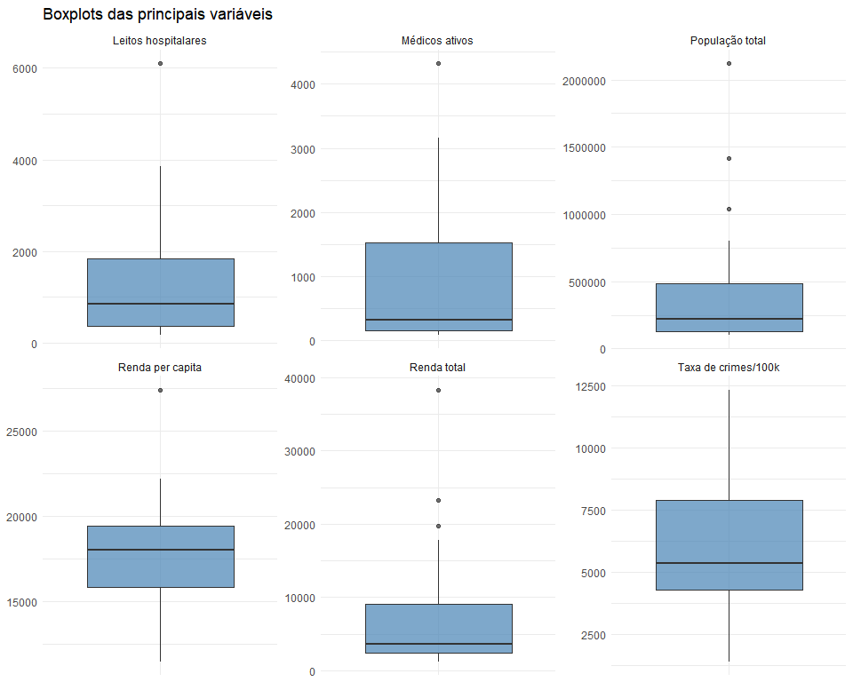
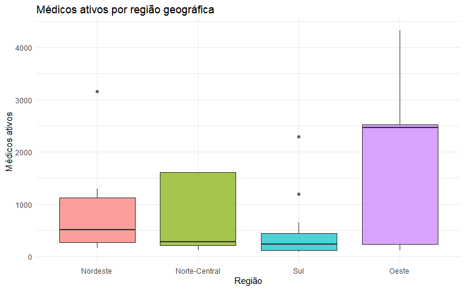
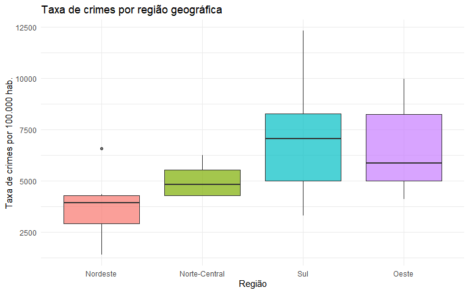
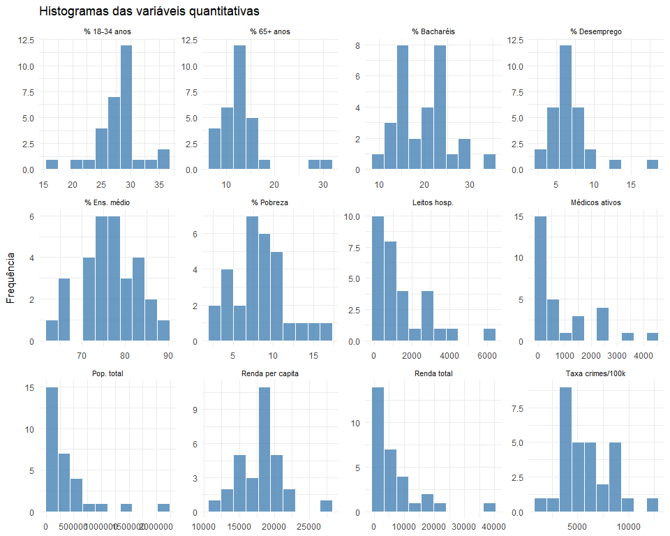
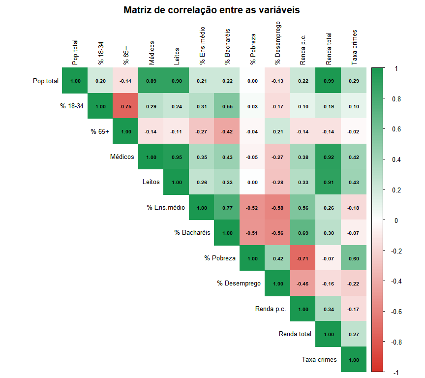

trabalho_regressao_linear
================

``` r
library(ggplot2)
library(tidyverse)
library(openxlsx)
library(readxl)
library(corrplot)

#setwd("C:/Users/Helio/OneDrive/Documents/Analise_regressao_linear/trabalho")

database <- read.xlsx("dados_trabalho.xlsx")

# Criar taxa de crimes por 100.000 habitantes
database$taxa_crimes <- database$x9 / database$x4 * 100000

# Região como fator com rótulos
database$x16 <- factor(database$x16, levels = 1:4,
                        labels = c("Nordeste", "Norte-Central", "Sul", "Oeste"))

head(database)
```

    ##   id          x1 x2   x3      x4   x5   x6    x7    x8     x9  x10  x11  x12
    ## 1  1 Los_Angeles CA 4060 8863164 32.1  9.7 23677 27700 688936 70.0 22.3 11.6
    ## 2  2        Cook IL  946 5105067 29.2 12.4 15153 21550 436936 73.4 22.8 11.1
    ## 3  3      Harris TX 1729 2818199 31.3  7.1  7553 12449 253526 74.9 25.4 12.5
    ## 4  4   San_Diego CA 4205 2498016 33.5 10.9  5905  6179 173821 81.9 25.3  8.1
    ## 5  5      Orange CA  790 2410556 32.6  9.2  6062  6369 144524 81.2 27.8  5.2
    ## 6  6       Kings NY   71 2300664 28.3 12.4  4861  8942 680966 63.7 16.6 19.5
    ##   x13   x14    x15           x16 taxa_crimes
    ## 1 8.0 20786 184230         Oeste    7773.026
    ## 2 7.2 21729 110928 Norte-Central    8558.869
    ## 3 5.7 19517  55003           Sul    8996.029
    ## 4 6.1 19588  48931         Oeste    6958.362
    ## 5 4.8 24400  58818         Oeste    5995.463
    ## 6 9.5 16803  38658      Nordeste   29598.672

## Amostragem

``` r
set.seed(123)

indices_amostra <- sample(1:nrow(database), size = 30, replace = FALSE)

dados_modelo    <- database[indices_amostra, ]
dados_validacao <- database[-indices_amostra, ]

cat("Observações para o modelo:   ", nrow(dados_modelo), "\n")
```

    ## Observações para o modelo:    30

``` r
cat("Observações para validação:  ", nrow(dados_validacao), "\n")
```

    ## Observações para validação:   410

## Classificação das Variáveis

``` r
classificacao <- data.frame(
  Código      = c("x3","x4","x5","x6","x7","x8","x9","x10","x11","x12","x13","x14","x15","x16","taxa_crimes"),
  Descrição   = c("Área da cidade (mi²)","População total","% pop. 18-34 anos",
                  "% pop. 65+ anos","Médicos ativos","Leitos hospitalares",
                  "Total de crimes","% ensino médio completo","% bacharéis",
                  "% abaixo da pobreza","% desempregados","Renda per capita",
                  "Renda total (mi USD)","Região geográfica","Taxa de crimes/100k hab."),
  Tipo        = c("Quantitativa","Quantitativa","Quantitativa","Quantitativa",
                  "Quantitativa","Quantitativa","Quantitativa","Quantitativa",
                  "Quantitativa","Quantitativa","Quantitativa","Quantitativa",
                  "Quantitativa","Qualitativa","Quantitativa"),
  Escala      = c("Razão","Razão","Razão","Razão","Razão","Razão","Razão",
                  "Razão","Razão","Razão","Razão","Razão","Razão","Nominal","Razão")
)

knitr::kable(classificacao, caption = "Classificação das variáveis do estudo")
```

| Código      | Descrição                | Tipo         | Escala  |
|:------------|:-------------------------|:-------------|:--------|
| x3          | Área da cidade (mi²)     | Quantitativa | Razão   |
| x4          | População total          | Quantitativa | Razão   |
| x5          | % pop. 18-34 anos        | Quantitativa | Razão   |
| x6          | % pop. 65+ anos          | Quantitativa | Razão   |
| x7          | Médicos ativos           | Quantitativa | Razão   |
| x8          | Leitos hospitalares      | Quantitativa | Razão   |
| x9          | Total de crimes          | Quantitativa | Razão   |
| x10         | % ensino médio completo  | Quantitativa | Razão   |
| x11         | % bacharéis              | Quantitativa | Razão   |
| x12         | % abaixo da pobreza      | Quantitativa | Razão   |
| x13         | % desempregados          | Quantitativa | Razão   |
| x14         | Renda per capita         | Quantitativa | Razão   |
| x15         | Renda total (mi USD)     | Quantitativa | Razão   |
| x16         | Região geográfica        | Qualitativa  | Nominal |
| taxa_crimes | Taxa de crimes/100k hab. | Quantitativa | Razão   |

Classificação das variáveis do estudo

## Análise Descritiva

### Medidas Resumo

``` r
vars_num <- dados_modelo[, c("x3","x4","x5","x6","x7","x8","x9",
                              "x10","x11","x12","x13","x14","x15","taxa_crimes")]

resumo <- data.frame(
  Variável = names(vars_num),
  N        = sapply(vars_num, function(x) sum(!is.na(x))),
  Média    = sapply(vars_num, mean, na.rm = TRUE),
  Mediana  = sapply(vars_num, median, na.rm = TRUE),
  DP       = sapply(vars_num, sd, na.rm = TRUE),
  Mín      = sapply(vars_num, min, na.rm = TRUE),
  Máx      = sapply(vars_num, max, na.rm = TRUE)
)

resumo[, 3:7] <- round(resumo[, 3:7], 2)

knitr::kable(resumo, row.names = FALSE,
             caption = "Estatísticas descritivas — amostra de modelagem (n=30)")
```

| Variável    |   N |     Média |   Mediana |        DP |       Mín |        Máx |
|:------------|----:|----------:|----------:|----------:|----------:|-----------:|
| x3          |  30 |   1822.23 |    694.00 |   3878.08 |    331.00 |   20062.00 |
| x4          |  30 | 390922.03 | 219253.50 | 446938.22 | 100498.00 | 2122101.00 |
| x5          |  30 |     27.92 |     28.20 |      3.85 |     16.40 |      35.70 |
| x6          |  30 |     13.18 |     12.55 |      5.05 |      7.60 |      30.70 |
| x7          |  30 |    930.87 |    324.50 |   1124.17 |     87.00 |    4320.00 |
| x8          |  30 |   1363.53 |    843.50 |   1399.20 |    163.00 |    6104.00 |
| x9          |  30 |  26148.40 |  15564.50 |  36147.23 |   1799.00 |  177593.00 |
| x10         |  30 |     76.57 |     77.40 |      6.49 |     63.00 |      88.90 |
| x11         |  30 |     19.52 |     19.45 |      5.86 |      9.70 |      34.20 |
| x12         |  30 |      8.38 |      8.30 |      3.32 |      2.70 |      16.60 |
| x13         |  30 |      6.74 |      6.05 |      2.88 |      2.90 |      17.80 |
| x14         |  30 |  17901.57 |  18019.50 |   3094.21 |  11490.00 |   27391.00 |
| x15         |  30 |   7297.67 |   3694.00 |   8273.93 |   1228.00 |   38287.00 |
| taxa_crimes |  30 |   5923.85 |   5369.52 |   2380.33 |   1397.84 |   12311.87 |

Estatísticas descritivas — amostra de modelagem (n=30)

### Distribuição por Região

``` r
knitr::kable(
  table(dados_modelo$x16),
  col.names = c("Região", "Frequência"),
  caption   = "Frequência de cidades por região geográfica — amostra de modelagem"
)
```

| Região        | Frequência |
|:--------------|-----------:|
| Nordeste      |          6 |
| Norte-Central |          5 |
| Sul           |         12 |
| Oeste         |          7 |

Frequência de cidades por região geográfica — amostra de modelagem

### Boxplots

``` r
vars_box <- dados_modelo %>%
  select(x4, x7, x8, x14, x15, taxa_crimes) %>%
  pivot_longer(everything(), names_to = "variavel", values_to = "valor") %>%
  mutate(variavel = recode(variavel,
    x4 = "População total", x7 = "Médicos ativos",
    x8 = "Leitos hospitalares", x14 = "Renda per capita",
    x15 = "Renda total", taxa_crimes = "Taxa de crimes/100k"))

ggplot(vars_box, aes(x = variavel, y = valor)) +
  geom_boxplot(fill = "steelblue", alpha = 0.7) +
  facet_wrap(~variavel, scales = "free", ncol = 3) +
  labs(title = "Boxplots das principais variáveis", x = NULL, y = NULL) +
  theme_minimal() +
  theme(axis.text.x = element_blank(), strip.text = element_text(size = 9))
```

<!-- -->

``` r
ggplot(dados_modelo, aes(x = x16, y = x7, fill = x16)) +
  geom_boxplot(alpha = 0.7) +
  labs(title = "Médicos ativos por região geográfica",
       x = "Região", y = "Médicos ativos") +
  theme_minimal() +
  theme(legend.position = "none")
```

<!-- -->

``` r
ggplot(dados_modelo, aes(x = x16, y = taxa_crimes, fill = x16)) +
  geom_boxplot(alpha = 0.7) +
  labs(title = "Taxa de crimes por região geográfica",
       x = "Região", y = "Taxa de crimes por 100.000 hab.") +
  theme_minimal() +
  theme(legend.position = "none")
```

<!-- -->

### Histogramas

``` r
vars_hist <- dados_modelo %>%
  select(x4, x5, x6, x7, x8, x10, x11, x12, x13, x14, x15, taxa_crimes) %>%
  pivot_longer(everything(), names_to = "variavel", values_to = "valor") %>%
  mutate(variavel = recode(variavel,
    x4 = "Pop. total", x5 = "% 18-34 anos", x6 = "% 65+ anos",
    x7 = "Médicos ativos", x8 = "Leitos hosp.", x10 = "% Ens. médio",
    x11 = "% Bacharéis", x12 = "% Pobreza", x13 = "% Desemprego",
    x14 = "Renda per capita", x15 = "Renda total", taxa_crimes = "Taxa crimes/100k"))

ggplot(vars_hist, aes(x = valor)) +
  geom_histogram(bins = 10, fill = "steelblue", color = "white", alpha = 0.8) +
  facet_wrap(~variavel, scales = "free", ncol = 4) +
  labs(title = "Histogramas das variáveis quantitativas", x = NULL, y = "Frequência") +
  theme_minimal() +
  theme(strip.text = element_text(size = 8))
```

<!-- -->

### Gráfico de Correlação

``` r
vars_cor <- dados_modelo %>%
  select(x4, x5, x6, x7, x8, x10, x11, x12, x13, x14, x15, taxa_crimes)

names(vars_cor) <- c("Pop.total","% 18-34","% 65+","Médicos","Leitos",
                     "% Ens.médio","% Bacharéis","% Pobreza",
                     "% Desemprego","Renda p.c.","Renda total","Taxa crimes")

matriz_cor <- cor(vars_cor, use = "complete.obs")

corrplot(matriz_cor,
         method  = "color",
         type    = "upper",
         addCoef.col = "black",
         number.cex  = 0.6,
         tl.cex  = 0.8,
         tl.col  = "black",
         col     = colorRampPalette(c("#d73027","white","#1a9850"))(200),
         title   = "Matriz de correlação entre as variáveis",
         mar     = c(0, 0, 2, 0))
```

<!-- -->
